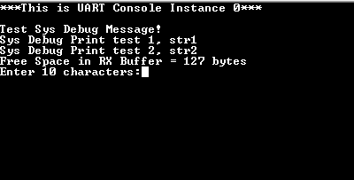
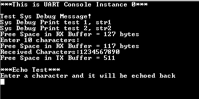
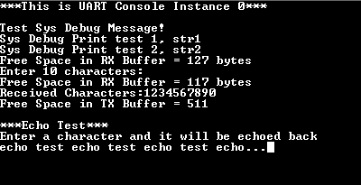

# Console Debug System Service using UART

This example application demonstrates the UART based console and debug system  service.

**Parent topic:**[Harmony 3 Driver, System Services and RTOS Application Examples for PIC32CK GC/SG Family](GUID-CDB24A84-49B8-4114-B4EF-E80CFD24D7D9.md)

## Description

-   The application example first demonstrates the various debug system service macros
-   It then demonstrates the console related APIs
-   The application asks the user to enter a character on the console which is echoed back using the console system service read/write APIs

## Downloading and Building the Application

To clone or download this application from Github, go to the [main page of this repository](https://github.com/Microchip-MPLAB-Harmony/core_apps_pic32ck_sg_gc) and then  click **Clone** button to clone this repository or download as zip file. This  content can also be downloaded using content manager by following these [instructions](https://github.com/Microchip-MPLAB-Harmony/contentmanager/wiki).

Path of the application within the repository is  **apps/system/console\_debug/sys\_console\_debug\_uart\_read\_write/firmware**.

To build the application, refer to the following table and open the project using its  IDE.

|Project Name|Description|
|------------|-----------|
|pic32ck\_gc01\_cult.X|MPLABX project for [PIC32CK GC01 Curiosity Ultra Development Board](https://www.microchip.com/en-us/development-tool/ea23j82a)|

## Setting Up the Hardware

The following table shows the target hardware for the application projects.

|Project Name|Description|
|------------|-----------|
|pic32ck\_gc01\_cult.X|[PIC32CK GC01 Curiosity Ultra Development Board](https://www.microchip.com/en-us/development-tool/ea23j82a)|

### Setting Up PIC32CK GC01 Curiosity Ultra Development Board

-   Connect the Debug USB port on the board to the computer using a micro USB cable

## Running the Application

1.  Open the Terminal application \(Ex.:Tera term\) on the computer
2.  Connect to the PKOB4 Virtual COM port and configure the serial settings as follows:
    -   Baud : 115200
    -   Data : 8 Bits
    -   Parity : None
    -   Stop : 1 Bit
    -   Flow Control : None
3.  Build and Program the application using its IDE
4.  Observe the following output on the terminal

    

    -   First few prints demonstrate the output from the debug system service APIs
    -   It then prints the free space available in the receive buffer
    -   It then asks the user to enter 10 characters
5.  After entering 10 characters, observe the following output on the terminal

    

    -   The output first prints the free space available in the receive buffer
    -   Since 10 characters are pending to be read out from the receive buffer, the free space in the receive buffer is reduced by 10
    -   After this, it prints the received characters on the terminal
    -   Application then waits for the transmit buffer to become empty
    -   Once empty, the application prints the free space available in the transmit buffer, which should be same as the size of the transmit buffer configured in MHC minus 1
6.  After this, the demonstration asks the user to enter a character, and echoes it back on the terminal.

    

    -   LED toggles every-time the character is printed on the terminal

Refer to the following table for LED name:

|Board|LED Name|
|-----|--------|
|[PIC32CK GC01 Curiosity Ultra Development Board](https://www.microchip.com/en-us/development-tool/ea23j82a)|LED0|

